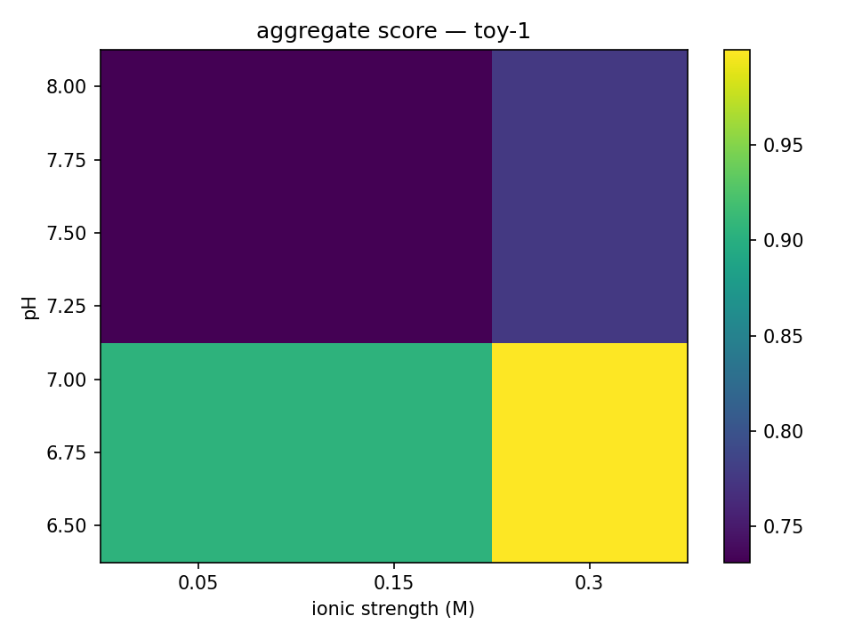

## TL;DR
Condition-aware, multi-state interface re-scoring for drug discovery.

**One-command demo**
```bash
source .venv/bin/activate
bash scripts/run_all.sh
open runs/summary.html


# Conditioned Ensemble Interface

Professional starter skeleton.
## Condition sensitivity demo
We sweep pH and ionic strength and aggregate the pose scores.



## Mini-benchmark (no download)
Build a tiny labeled dataset (2 complexes × 2 poses) from local files, then train, predict, aggregate, and evaluate:

```bash
# build dataset from manifest
python scripts/build_dataset_from_manifest.py --manifest benchmarks/minipep/manifest.csv --out datasets/minipep.jsonl

# train
python scripts/train_gbt.py --dataset datasets/minipep.jsonl --out artifacts/minipep_model.joblib

# predict
cei --config configs/minipep.yaml --out runs/minipep_preds.jsonl

# aggregate
python scripts/aggregate_and_filter.py --dataset datasets/minipep.jsonl --pred runs/minipep_preds.jsonl --out runs/minipep_summary.csv --method softmax --temperature 1.0

# evaluate
python scripts/eval_topk.py --dataset datasets/minipep.jsonl --pred runs/minipep_preds.jsonl


Commit and push:
```bash
git add -A
git commit -m "Add mini-benchmark scaffold: manifest → dataset → train/predict/aggregate → eval"
git push
